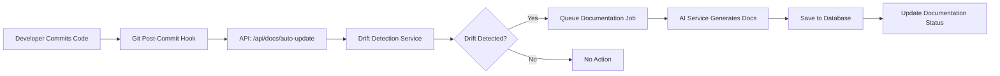
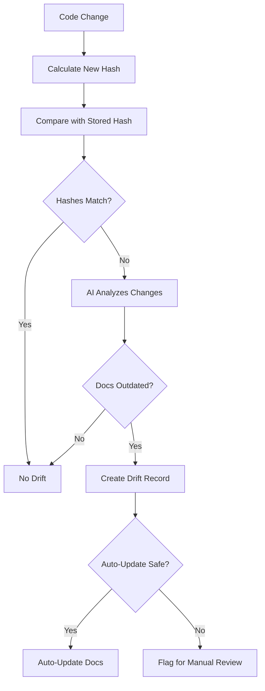

# Technical Documentation Auto-Generator

## Overview

Transform your code review platform into a comprehensive **Technical Documentation Auto-Generator** that makes documentation a byproduct of development rather than a separate chore.

### The Problem We're Solving

- Developers hate writing documentation
- Documentation gets outdated immediately
- New team members struggle to understand codebases
- Code reviews miss documentation updates

### Our Solution

An AI-powered system that:
- ✅ **Generates documentation automatically on every commit**
- ✅ **Detects when code changes make docs obsolete**
- ✅ **Creates architecture overviews, API references, and onboarding guides**
- ✅ **Integrates seamlessly with Git workflows**
- ✅ **Requires zero effort from developers**

---

## Features

### 1. **AI-Powered Documentation Generation**

Generate multiple types of documentation automatically:

- **Architecture Overviews** - High-level system design and component relationships
- **API References** - Comprehensive function/class documentation
- **Usage Examples** - Real examples extracted from tests
- **Onboarding Guides** - New developer quick-start guides
- **Changelogs** - Auto-generated from commit history
- **Dependency Maps** - Visual diagrams of code dependencies

### 2. **Documentation Drift Detection**

Automatically detect when code changes make documentation outdated:

- Tracks code hashes for each documented file
- AI analyzes code changes to determine if docs need updating
- Severity levels: low, medium, high, critical
- Auto-update suggestions for safe changes
- PR comments to flag outdated documentation

### 3. **Git Hook Integration**

Zero-effort documentation updates via Git hooks:

- **Post-commit hooks** - Auto-generate docs after commits
- **Pre-push hooks** - Check for drift before pushing
- **GitHub webhooks** - Respond to PR and push events
- Configurable per project

### 4. **Dependency Analysis**

Understand your codebase structure:

- Dependency graph visualization (Mermaid diagrams)
- Critical module identification
- Circular dependency detection
- Architectural layer analysis
- Dependency health score (0-100)

### 5. **Documentation Dashboard**

Beautiful UI for viewing and managing documentation:

- Real-time drift percentage
- Documentation health metrics
- One-click generation
- Version history tracking
- Markdown rendering

---

## Architecture

```
┌─────────────────────────────────────────────────┐
│           Documentation Generator                │
│                                                  │
│  ┌──────────────┐  ┌──────────────────────────┐│
│  │ AI Service   │  │  Git Hook Service        ││
│  │ (Claude API) │  │  - post-commit           ││
│  └──────────────┘  │  - GitHub webhooks       ││
│                    └──────────────────────────┘│
│                                                  │
│  ┌──────────────────────────────────────────┐  │
│  │  Documentation Service                   │  │
│  │  - generate_architecture_overview()      │  │
│  │  - generate_api_reference()              │  │
│  │  - extract_usage_examples()              │  │
│  │  - generate_onboarding_guide()           │  │
│  │  - detect_documentation_drift()          │  │
│  └──────────────────────────────────────────┘  │
│                                                  │
│  ┌──────────────────────────────────────────┐  │
│  │  Drift Detection Service                 │  │
│  │  - check_project_for_drift()             │  │
│  │  - auto_update_documentation()           │  │
│  │  - get_drift_report()                    │  │
│  └──────────────────────────────────────────┘  │
│                                                  │
│  ┌──────────────────────────────────────────┐  │
│  │  Dependency Analyzer                     │  │
│  │  - analyze_project()                     │  │
│  │  - find_circular_dependencies()          │  │
│  │  - generate_mermaid_diagram()            │  │
│  └──────────────────────────────────────────┘  │
└─────────────────────────────────────────────────┘
           │
           ▼
┌─────────────────────────────────────────────────┐
│              Database Models                     │
│                                                  │
│  - Documentation                                 │
│  - DocumentationDrift                            │
│  - GitHook                                       │
└─────────────────────────────────────────────────┘
```

---

## Quick Start

### 1. Installation

The documentation generator is integrated into the existing Flask backend. All new services are already added to `backend-flask/`:

```bash
cd backend-flask

# Install dependencies
pip install anthropic gitpython pyyaml

# Set up environment variables
export ANTHROPIC_API_KEY="your-api-key"
export API_ENDPOINT="http://localhost:5000"
```

### 2. Database Migration

Create new database tables for documentation tracking:

```bash
# In backend-flask/
flask db migrate -m "Add documentation models"
flask db upgrade
```

### 3. Generate Documentation

#### Via API:

```bash
curl -X POST http://localhost:5000/api/docs/generate \
  -H "Content-Type: application/json" \
  -d '{
    "project_id": "your-project-id",
    "doc_types": ["architecture", "api_reference", "onboarding"]
  }'
```

#### Via Frontend:

1. Navigate to project page
2. Click "Documentation" tab
3. Click "Generate All Documentation"

### 4. Install Git Hooks

Auto-generate documentation on every commit:

```bash
curl -X POST http://localhost:5000/api/docs/hooks/install \
  -H "Content-Type: application/json" \
  -d '{
    "project_id": "your-project-id",
    "hook_type": "post-commit"
  }'
```

---

## API Endpoints

### Documentation Generation

| Endpoint | Method | Description |
|----------|--------|-------------|
| `/api/docs/generate` | POST | Generate documentation for a project |
| `/api/docs/project/<id>` | GET | Get all documentation for a project |
| `/api/docs/<id>` | GET | Get specific documentation by ID |
| `/api/docs/<id>` | DELETE | Delete documentation |

### Drift Detection

| Endpoint | Method | Description |
|----------|--------|-------------|
| `/api/docs/drift/check` | POST | Check for documentation drift |
| `/api/docs/drift/report/<project_id>` | GET | Get drift report |
| `/api/docs/drift/<id>/auto-update` | POST | Auto-update outdated docs |

### Git Hooks

| Endpoint | Method | Description |
|----------|--------|-------------|
| `/api/docs/hooks/install` | POST | Install Git hook |
| `/api/docs/hooks/<project_id>` | GET | Get project hooks |
| `/api/docs/hooks/<id>/uninstall` | DELETE | Uninstall hook |
| `/api/docs/auto-update` | POST | Handle hook triggers |
| `/api/docs/github-webhook` | POST | GitHub webhook handler |

### Analysis

| Endpoint | Method | Description |
|----------|--------|-------------|
| `/api/docs/dependencies/<project_id>` | GET | Analyze dependencies |
| `/api/docs/stats/<project_id>` | GET | Get documentation stats |

---

## How It Works

### Automatic Documentation Generation



### Drift Detection Process



---

## Database Schema

### Documentation Table

```sql
CREATE TABLE documentations (
    id VARCHAR(36) PRIMARY KEY,
    project_id VARCHAR(36) REFERENCES projects(id),
    doc_type ENUM('architecture', 'api_reference', 'usage_examples', 'onboarding', 'changelog', 'dependency_map'),
    title VARCHAR(255),
    content TEXT,
    status ENUM('current', 'outdated', 'needs_review'),
    file_path VARCHAR(500),
    version INTEGER,
    code_hash VARCHAR(64),
    metadata JSON,
    created_at TIMESTAMP,
    updated_at TIMESTAMP
);
```

### DocumentationDrift Table

```sql
CREATE TABLE documentation_drifts (
    id VARCHAR(36) PRIMARY KEY,
    documentation_id VARCHAR(36) REFERENCES documentations(id),
    file_path VARCHAR(500),
    old_code_hash VARCHAR(64),
    new_code_hash VARCHAR(64),
    commit_sha VARCHAR(40),
    drift_description TEXT,
    severity VARCHAR(20),
    auto_update_suggested BOOLEAN,
    detected_at TIMESTAMP
);
```

### GitHook Table

```sql
CREATE TABLE git_hooks (
    id VARCHAR(36) PRIMARY KEY,
    project_id VARCHAR(36) REFERENCES projects(id),
    hook_type VARCHAR(50),
    enabled BOOLEAN,
    config JSON,
    created_at TIMESTAMP,
    updated_at TIMESTAMP
);
```

---

## Service Documentation

### DocumentationService

**Location:** `backend-flask/services/documentation_service.py`

Core service for AI-powered documentation generation.

**Key Methods:**

- `generate_architecture_overview(file_tree, main_files_content)` - Generate system architecture docs
- `generate_api_reference(code_content, language)` - Generate API documentation
- `extract_usage_examples(test_files_content)` - Extract examples from tests
- `generate_onboarding_guide(file_tree, readme, main_files)` - Create new developer guide
- `generate_changelog_from_commits(commits)` - Generate changelog
- `detect_documentation_drift(old_code, new_code, existing_doc)` - Check if docs are outdated

### DriftDetectionService

**Location:** `backend-flask/services/drift_detection_service.py`

Detects and manages documentation drift.

**Key Methods:**

- `check_project_for_drift(project_id, changed_files)` - Check for drift in changed files
- `detect_drift_for_file(documentation, old_code, new_code)` - Check specific file
- `get_drift_report(project_id)` - Get comprehensive drift report
- `auto_update_documentation(drift_id)` - Automatically update docs
- `schedule_drift_checks(project_id)` - Schedule periodic checks

### GitHookService

**Location:** `backend-flask/services/git_hook_service.py`

Manages Git hooks for auto-documentation.

**Key Methods:**

- `install_hook(project_id, hook_type)` - Install Git hook
- `uninstall_hook(project_id, hook_type)` - Remove hook
- `setup_github_webhook(project_id, repo, secret)` - Configure GitHub webhook
- `handle_commit_event(project_id, commit_data)` - Process commit events
- `handle_pr_event(project_id, pr_data)` - Process PR events

### DependencyAnalyzer

**Location:** `backend-flask/services/dependency_analyzer.py`

Analyzes code dependencies and generates visualizations.

**Key Methods:**

- `analyze_project(local_path)` - Full dependency analysis
- `find_critical_modules()` - Identify most important modules
- `find_circular_dependencies()` - Detect circular deps
- `generate_mermaid_diagram()` - Create dependency diagram
- `get_dependency_health_score()` - Calculate health score (0-100)

---

## Business Model

### Pricing Tiers

#### Free Tier
- ✅ Up to 3 projects
- ✅ Basic documentation generation
- ✅ Manual drift detection
- ✅ 50 AI generations/month

#### Pro ($49/month)
- ✅ Unlimited projects
- ✅ Auto drift detection
- ✅ Git hook integration
- ✅ 1,000 AI generations/month
- ✅ Priority support

#### Team ($99/month)
- ✅ Everything in Pro
- ✅ Unlimited AI generations
- ✅ GitHub webhook integration
- ✅ Custom documentation templates
- ✅ API access
- ✅ SSO/SAML

#### Enterprise (Custom)
- ✅ Everything in Team
- ✅ Self-hosted option
- ✅ Custom integrations
- ✅ SLA guarantee
- ✅ Dedicated support

---

## Go-To-Market Strategy

### Phase 1: Developer Love (Months 1-3)

**Goal:** Get first 1,000 users

1. **Launch Strategy**
   - Post on HackerNews with demo video
   - Share on /r/programming, /r/webdev
   - ProductHunt launch
   - Dev.to article series

2. **Content Marketing**
   - "Why AI-Generated Documentation Doesn't Suck Anymore"
   - "How to Onboard Developers in 5 Minutes"
   - Video tutorials on YouTube

3. **Open Source Strategy**
   - Make core engine open source
   - Accept community contributions
   - Build GitHub stars

### Phase 2: Team Adoption (Months 4-8)

**Goal:** 100 paying teams

1. **Team Features**
   - Slack/Discord integration
   - Team analytics dashboard
   - Collaborative documentation editing

2. **Case Studies**
   - Document time saved
   - Interview early adopters
   - Create success stories

3. **Integration Partners**
   - Integrate with Notion
   - Integrate with Confluence
   - GitBook integration

### Phase 3: Enterprise (Months 9-12)

**Goal:** First 10 enterprise customers

1. **Enterprise Features**
   - Self-hosted deployment
   - SSO/SAML integration
   - Compliance certifications (SOC 2, GDPR)

2. **Sales Strategy**
   - Hire enterprise sales team
   - Attend developer conferences
   - Partner with consulting firms

---

## Competitive Advantages

1. **AI-Powered** - Uses Claude to understand intent, not just structure
2. **Zero-Effort** - Completely automatic via Git hooks
3. **Drift Detection** - Unique feature that keeps docs current
4. **Multi-Format** - Generates architecture, API, examples, onboarding
5. **Developer-First** - Built by developers, for developers

---

## Technical Risks & Solutions

### Risk: AI Hallucinations

**Solution:**
- Use code hashes to track actual code
- Implement confidence scoring
- Allow manual review before publishing
- Learn from user corrections

### Risk: Large Codebase Performance

**Solution:**
- Process files incrementally
- Use background job queues
- Cache AI responses
- Only re-generate changed files

### Risk: Privacy Concerns

**Solution:**
- Self-hosted option for enterprises
- Never store code on our servers (only hashes)
- End-to-end encryption
- SOC 2 compliance

### Risk: GitHub Rate Limits

**Solution:**
- Smart caching
- Batch API requests
- Support multiple git providers
- Local git operations where possible

---

## Roadmap

### Q1 2025: MVP
- ✅ Basic documentation generation
- ✅ Drift detection
- ✅ Git hook integration
- ✅ Web dashboard

### Q2 2025: Growth
- Multi-language support (all major languages)
- GitHub App integration
- Slack notifications
- Custom templates

### Q3 2025: Scale
- GitLab integration
- Bitbucket support
- API documentation
- Team collaboration features

### Q4 2025: Enterprise
- Self-hosted version
- SSO/SAML
- Advanced analytics
- White-label option

---

## Success Metrics

### Developer Metrics
- Time to first documentation: < 5 minutes
- Documentation freshness: > 90% current
- Developer satisfaction: > 4.5/5 stars

### Business Metrics
- Monthly Recurring Revenue (MRR)
- Customer Acquisition Cost (CAC)
- Lifetime Value (LTV)
- Churn rate: < 5%

### Product Metrics
- Daily Active Users (DAU)
- Documentation generations per user
- Git hook installation rate
- Drift detection accuracy

---

## Support & Contact

- **Documentation:** [docs.autodocgen.com](https://docs.autodocgen.com)
- **GitHub:** [github.com/yourorg/auto-doc-generator](https://github.com)
- **Discord:** [discord.gg/autodocgen](https://discord.gg)
- **Email:** support@autodocgen.com

---

## License

MIT License - See LICENSE file for details

---

**Built with ❤️ using Claude Code and Anthropic's Claude API**

Making documentation a byproduct of development, not a separate chore.
